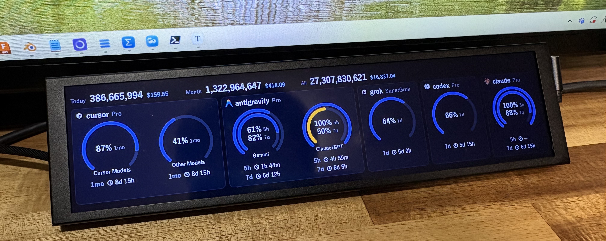
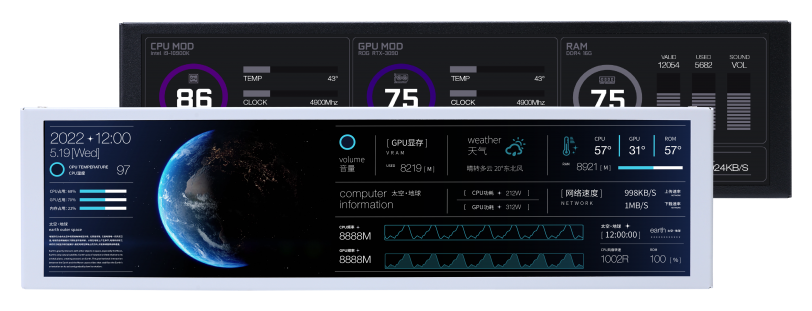
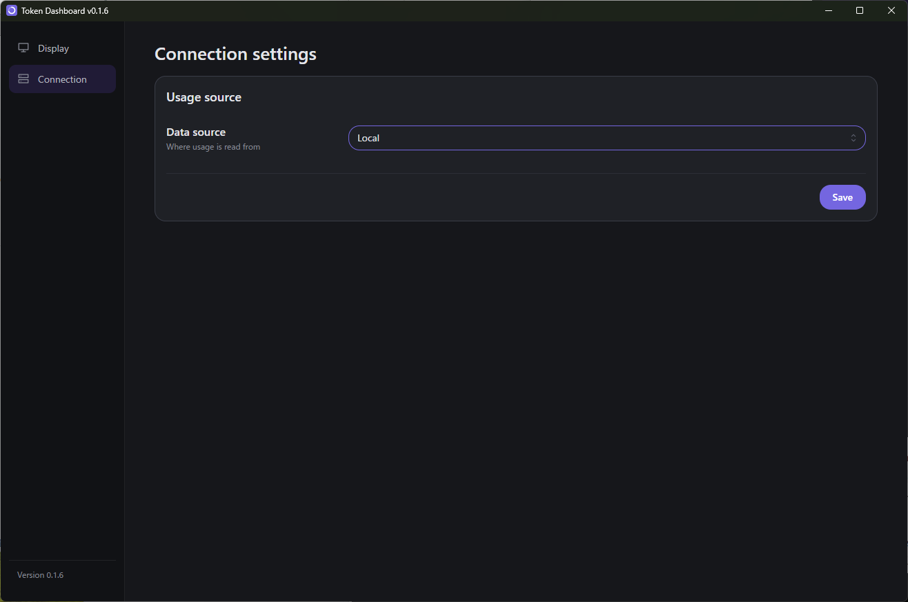
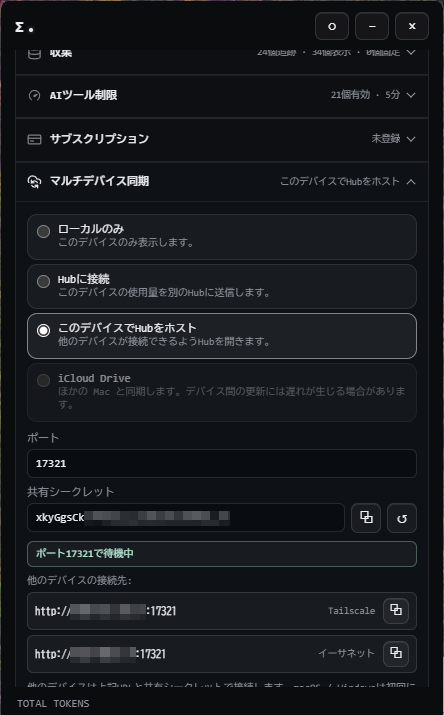
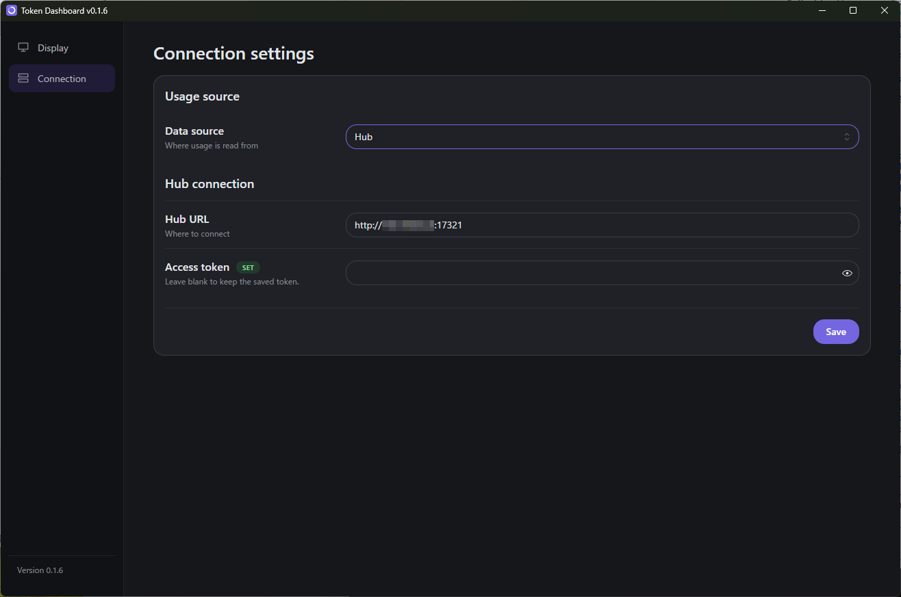
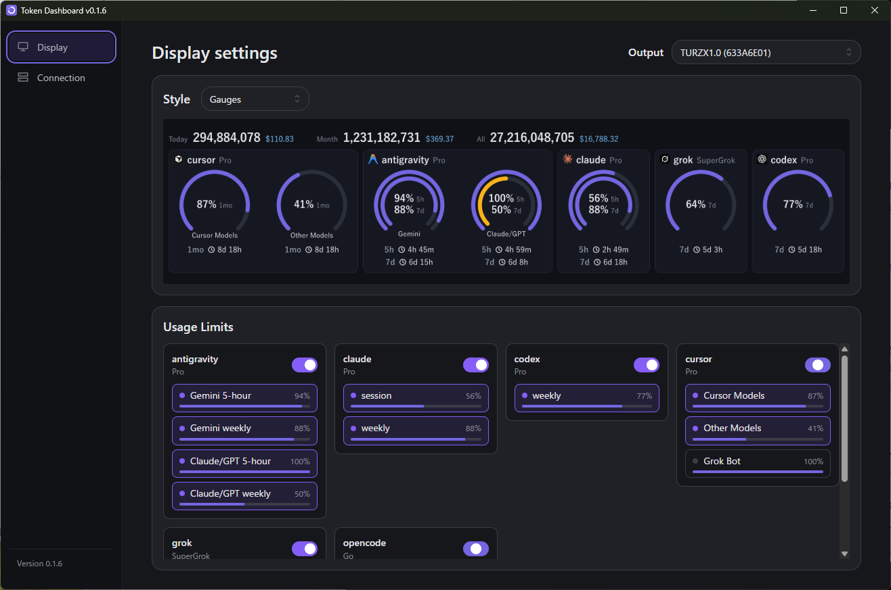

# Token Dashboard

AI コーディングアシスタントや LLM ツールのトークン消費量・推定コスト・利用枠の残量を、TURZX 9.2 インチ USB ディスプレイへリアルタイムに常時表示する Windows アプリケーションです。

Windows へのサインイン時に自動でバックグラウンド起動し、タスクトレイに常駐します。トレイアイコンからウィンドウを開くことで、ディスプレイと同じ表示内容のプレビュー確認や各種設定が行えます。

## 対応OS

- **Windows 11 (x64)**
  - Microsoft Edge WebView2 Runtime が必要です（Windows 11 では通常標準搭載されています）。
  - ※Windows 10 以前や、macOS・Linux 等の他 OS には対応していません。

## 対応ハードウェア

*画像引用元: [TURZX 9.2 Inch Detail (turzx.com)](https://www.turzx.com/en/2026/09/14/turzx-9-2-inch-detail/)*

本アプリは、PC のステータス表示向けに設計された横長 USB スマートディスプレイ「**TURZX 9.2 インチ**」（解像度 1920×462）に対応しています。

- **製品概要**: 解像度 1920×462 px のウルトラワイド液晶ディスプレイです。USB ケーブル（Type-C）1 本で給電とデータ通信を行い、PC デスク上や PC ケース内に設置して情報を常時表示できます。
- **公式製品情報**: [TURZX 9.2-inch Smart Display](https://www.turzx.com/en/2026/09/14/turzx-9-2-inch-detail/)
- **購入先参考**:
  - [AliExpress（動作確認済み）](https://ja.aliexpress.com/item/1005009533369374.html)
  - [Amazon（OEM同等品と思われる候補・動作確証なし）](https://www.amazon.co.jp/dp/B0H1BLTL7C)

専用のディスプレイドライバーの追加インストールは不要です。PC の USB ポートに付属ケーブルで接続するだけで自動的に認識・通信します。

### 本ディスプレイの特徴とメリット

TURZX スマートディスプレイは、一般的な HDMI/DisplayPort 接続のサブモニターとは異なり、USB 経由で画像データを直接転送して表示する「電子ウォールペーパー（Turing Smart Screen）」のような仕組みを採用しています。

- **PC からは通常のディスプレイとして認識されない（GPU・画面領域の負荷ゼロ）**:
  - Windows のマルチディスプレイ設定に追加モニターとして認識されないため、GPU や映像出力への負荷がありません（公式サイトでも「zero GPU overhead」と表現されています）。
  - マウスポインターが誤って迷い込んだり、作業中のウィンドウが吸い込まれたりする心配がありません。
- **作業画面を占有せず、操作画面によって表示が隠されない**:
  - 一般のモニターのような自由なウィンドウ操作は行えませんが、その反面「ステータス表示に特化した専用ハードウェア」として動作します。
  - PC 上でエディターやブラウザー、ゲームなどを全画面で操作していても、ダッシュボードが他のウィンドウの背面に隠されることがありません。
  - 作業領域を一切犠牲にせず、目線を送るだけでトークン消費量や利用枠の残量を常時確認できる「専用ダッシュボード」として極めて優れています。

## インストール

1. [GitHub Releases](https://github.com/nuitsjp/token-dashboard/releases) から最新版のインストーラー（`token-monitor-turzx-<version>-amd64-setup.exe`）をダウンロードします。
2. インストーラーを実行してセットアップを完了します。
3. インストール完了後、アプリが自動起動してタスクトレイに常駐します。以降は Windows サインイン時にも自動起動します。

## クイックスタート

### 1. USB ディスプレイを接続する

付属の USB ケーブルで TURZX ディスプレイを Windows PC に接続します。アプリ側の「Display」画面右上にある **Output** ドロップダウンにデバイス名（例: `TURZX1.0 (xxxx)`）が表示されていれば認識成功です。

### 2. 利用状況の取得元を設定する

用途や環境に合わせて「Local モード」または「Hub モード」を選択できます。ウィンドウ左側の **Connection** メニューから設定します。

#### パターン A: Local モード（手軽に単体で使う）

Token Monitor を別途導入せず、手軽に使い始めたい場合におすすめです。同梱の取得ツール（tokscale）を用いて、この PC ローカルで動作している AI ツール（Claude Code, Codex 等）の利用ログを直接読み取ります。

1. 左メニューの **Connection** を開きます。
2. **Data source** で `Local` を選択します。
3. **Save** をクリックします。

> [!NOTE]
> **Local モードの制限事項**:
> - **対応ツールの制限（Antigravity や Cursor は非対応）**: ローカルログから直接読み取れるツール（Claude Code, Codex 等）のみが集計対象です。Antigravity や Cursor などの利用状況は Local モードでは取得できません。
> - **この PC のみ対象（複数端末の合算不可）**: この Windows PC 上で動作した AI ツールのローカルログのみを集計します。他の PC や Mac、リモート環境での利用量は集計されません。
> - **複数アカウント・一部サービスの非対応**: ツールごとに複数アカウントを登録・合算することや、Token Monitor が対応している一部のプロバイダー・利用枠が取得できない場合があります。また、表示される契約名や利用枠の定義が異なる場合があります。
> - **取得間隔**: 利用枠の残量取得は 2 分ごとの定期確認となります。
>
> これらの制限を回避し、Antigravity や Cursor を含む 40 種類以上の AI ツールの利用状況、複数端末でのトークン合算、複数アカウントの管理、および完全リアルタイムな同期を行いたい場合は、**[Token Monitor](https://github.com/Javis603/token-monitor)** を導入して **パターン B（Hub モード）** でご利用ください。

#### パターン B: Hub モード（Token Monitor と連携する）

複数端末の集約データや、クラウド経由の詳細な利用量・契約アカウント枠を表示したい場合は、[Token Monitor](https://github.com/Javis603/token-monitor) との連携を推奨します。

##### ① Token Monitor 側の設定（Hub のホスト）
Token Monitor を起動し、設定画面を開きます。

1. 「マルチデバイス同期」項目で **「このデバイスでHubをホスト」** を選択します。
2. 「ポート」（既定: `17321`）および「共有シークレット」を確認します。
3. 「他のデバイスの接続先:」に表示されている接続先 URL（LAN IP や Tailscale IP、例: `http://192.168.0.x:17321`）を控えます。

##### ② Token Dashboard 側の設定
本アプリのウィンドウに戻り、接続先を設定します。

1. 左メニューの **Connection** を開きます。
2. **Data source** で `Hub` を選択します。
3. **Hub URL** に、手順 ① で確認した接続先 URL（例: `http://192.168.0.17:17321`）を入力します。
4. **Access token** に、手順 ① の共有シークレットを入力します。
5. **Save** をクリックします。正常に接続されると、プレビュー画面および TURZX ディスプレイにリアルタイムなデータが反映されます。

## 表示のカスタマイズ

アプリのメインウィンドウ（**Display** 画面）では、TURZX ディスプレイのプレビュー確認や表示内容のカスタマイズが行えます。

- **表示スタイル (Style)**:
  - `Gauges`: 円形メーター形式で各利用枠の使用率を表示します。
  - `Bars`: 横棒グラフ形式でコンパクトに表示します。
- **表示する利用枠の選択 (Usage Limits)**:
  - 画面下部のカードから、ディスプレイに表示したい利用枠（Gemini, Claude, Codex, Cursor 等）のトグルスイッチを ON / OFF できます。
  - TURZX の画面領域に収まる件数が優先して表示されます。

## アプリの更新

新バージョンが公開されると、ウィンドウ上部に通知バーが表示されます。「Update and restart」をクリックするだけで、最新版への更新とアプリの再起動が自動的に行われます。

## 開発・カスタマイズ

自作のスクリプトやツールから TURZX スマートディスプレイを直接制御したい方向けに、仕組みや通信仕様のドキュメントを公開しています。

- [AI専用ダッシュボードの作り方](docs/how-to-build-ai-dashboard.md): デバイスの概要、パケット構造、Go による最小限の実装例
- [TURZX 操作アーキテクチャ](docs/turzx-architecture.md): レイヤー設計、フロー制御、プロトコルの詳細仕様

