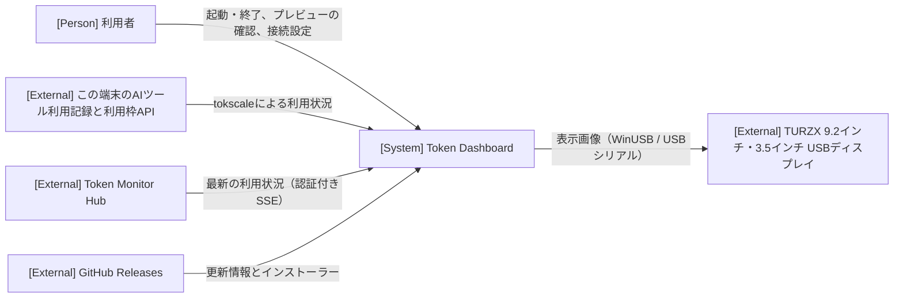

# アーキテクチャ

全体構造、共通方針、設計上の制約の正本です。具体的な処理は実現パターンの設計、保存形式は [データ設計](design/data.md)、仕様は [ユースケース一覧](project.md#usecases) から参照します。

## 1. システムコンテキスト

## 2. コンテナ

| コンテナ | 技術 | 責務 | リポジトリ内パス |
| --- | --- | --- | --- |
| 常駐アプリ本体 | Go・Wails v3、同梱した tokscale | タスクトレイ常駐、選択した取得元からの取得、9.2インチの描画要求と結果の確定、3.5インチの画像生成、TURZX への送信、設定の保存、新版の確認・取得・検証 | `main.go`、`internal/` |
| ウィンドウと画像生成処理 | React・TypeScript（WebView2）、Handlebars・HTML/CSS・Canvas | 非表示中も動く画像生成処理、確定した表示画像のプレビュー、接続設定の入力、更新の適用操作 | `frontend/`、`themes/` |
| 更新インストーラー | NSIS | アプリ本体の終了後にファイルと登録情報（サインイン時の自動起動を含む）を更新し、アプリを再起動する | `build/windows/nsis/` |

状態の所有者は常駐アプリ本体です。取得した最新の利用状況は本体のメモリにだけ持ち、保存しません。取得元・接続設定・表示先と表示設定の保存形式は [データ設計](design/data.md) に記します。9.2インチは本体が要求した1枚をWebView2内のCanvasで描き、その描画からPNGと回転したJPEGを生成して本体へ返します。3.5インチは本体のGo描画器で画像とPNGを生成し、送信時にRGB565へ変換します。プレビュー区画は確定したPNGを表示し、独自には描画しません。ウィンドウを閉じても本体と画像生成処理はタスクトレイで動き続けます。

依存方向は、ウィンドウ画面から本体の Wails サービスへの呼び出しと、本体からウィンドウ画面へのイベント通知だけです。検証では次の外部境界を使い、本番の実行経路に固定データの切り替えを置きません。

- **Hub と本体の間**: モックの合成点は置きません。検証時は、接続設定の URL を制御可能な SSE サーバーへ向けます。
- **本体と TURZX の間**: モックの合成点は置きません。自動検証は機器を接続しない状態で行い、表示内容はプレビューで確認します。TURZX への実表示は実機で確認します。
- **本体と GitHub Releases の間**: 検証用ビルドで更新元を署名付きの更新情報とインストーラーを置いたローカルのフォルダーへ向けます。実行時のモック分岐は使いません。更新の E2E は実際のインストール・再起動を行います。
- **本体と tokscale の間**: Localの固定データによる確認は、外部CLIの実行ファイルを検証用のものに置き換えます。取得・集計・設定保存・描画・プレビューは本番処理です。起動手順は [プロジェクト定義](project.md#execution) に記します。

## 3. 実現パターン

各パターンの設計は、適用するユースケースに着手したときに `design/UCP-n.md` として作成します。

| 実現パターンの設計 | 適用条件・関与コンテナ |
| --- | --- |
| [UCP-1. 受信した最新状態を表示画像にして出力する](design/UCP-1.md) | 外部から受けた状態をメモリ上の最新状態へ反映し、1枚の表示画像を生成して TURZX とプレビューへ出力する（「利用状況をUSBディスプレイに表示する」）。常駐アプリ本体、ウィンドウ画面、外部の Hub と TURZX |
| [UCP-2. 入力した設定を検証・保存し、実行中の処理へ反映する](design/UCP-2.md) | 画面で入力した設定を本体で検証して保存し、依存する処理を新しい設定でやり直す（「利用状況の取得元と表示先を設定する」と「利用状況をUSBディスプレイに表示する」の表示設定）。常駐アプリ本体、ウィンドウ画面 |
| [UCP-3. 検証・引き渡し・外部プロセスによる確定](design/UCP-3.md) | 検証済みの更新を外部プロセスへ引き渡し、アプリの終了後に確定する（「新版を確認してアプリを更新する」）。常駐アプリ本体、ウィンドウ画面、更新インストーラー、外部の GitHub Releases |

## 4. 設計上の制約

- 選択した取得元からの取得、TURZX への送信、新版の確認は、それぞれ独立した goroutine で動かします。どれかの失敗や待機が、他の処理とタスクトレイ・ウィンドウの応答を止めないようにします。取得元を保存したら従前の取得処理を止め、選択した取得元だけを起動します。
- TURZX への送信は1台に限り、逐次で行います。送信中に次の表示画像ができた場合は、最新の1枚だけを残して前の画像を捨てます。画像には生成時の表示先・機種・向きの情報を持たせ、別機種用の画像を送らないようにします。送信中に切断された画像は再送せず、再接続後に最新の画像を送ります。
- 9.2インチの表示画像は 1920×462 で描き、時計回りに90度回転した Baseline JPEG（品質85）で送ります。3.5インチは設定した向きの解像度で描き、機器の向きを設定して Rev. A 方式の RGB565 画像を USB シリアルで送ります。プレビューには、送信前の同じ表示画像を渡します。機種ごとの表示内容は [表示ユースケース](usecases/利用状況をUSBディスプレイに表示する/README.md) に従います。
- 表示画像の描画には、Windows に標準で入っている游ゴシックを使います。フォントはアプリに同梱しません。
- 9.2インチは、標準のインターフェース GUID `GUID_DEVINTERFACE_USB_DEVICE` のうち VID/PID が `1CBE:0092` のものとして列挙し、抜き差しを検出します。ドライバーの導入時に決まる GUID には依存しません（[確認した事実](project.md#design)）。3.5インチは [プロジェクト定義の対象機種](project.md) の COM インターフェースを列挙し、機器識別子から接続先を解決します。COM 番号は固定しません。
- Hub の認証トークンは、本体から画面へ返しません。ログにも出しません。ログに書くのは、接続先を特定しない原因の分類だけです。
- 本体は多重起動を防ぎます。2つ目の起動では、既に動いている本体のウィンドウを表示します。
- 本番の画面は同梱したアセットだけを使います。外部のコンテンツにはアプリの権限を与えません。
