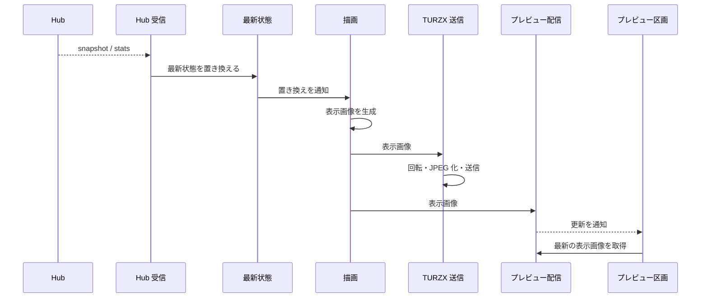

# UCP-1. 受信した最新状態を表示画像にして出力する

適用条件と関与コンテナは [アーキテクチャの一覧](../architecture.md#patterns) を参照します。図は主成功系列を役割名で示し、UC ごとの逸脱は末尾に記録します。

| 役割 | 責務 | 実装パス（段階4完了時に記入） |
| --- | --- | --- |
| Hub 受信 | 保存済みの接続設定で SSE に接続し、snapshot・stats を最新状態へ渡す。止まったら1秒から倍にしながら（上限60秒）再接続する。接続設定の保存時にも接続し直す | `internal/hub/receiver.go` |
| ローカル取得 | 取得元が `Local` のとき、同梱の tokscale を専用の設定ディレクトリで実行する。起動時に `clients --json` の探索先（Cursor を除く）の監視を始め、`cursor sync --json` の後に `graph --no-spinner` で3期間を集計し、並行して `usage --json` で利用枠を取得する。変更は最初の通知から2秒待ってまとめ、graph は開始間隔10秒以上・同時に1つまでとし、Cursor の同期とは同時に実行しない。変更と Cursor の同期に伴う利用枠の取得は graph の開始時に行い、graph より頻繁には取得しない。利用枠は前回の取得から45秒ごとにも取得し、Cursor の同期は起動時の結果に応じて45秒ごと・停止・待ち時間を倍にする再試行（上限10分）とする。日付が変わると集計し直す。集計と利用枠がそろってから最新状態へ渡し、内容が同じなら渡さない。失敗した値は前回のまま保つ。取得元の変更と終了時に監視と子プロセスを止める | `internal/localusage/reader.go`、`internal/localusage/tokscale.go`、`internal/localusage/platform_windows.go` |
| 最新状態 | 受信した利用状況をメモリにだけ保持し、置き換えを描画へ通知する | `internal/usage/usage.go` |
| 描画 | 最新状態の置き換えと1分ごとの時刻で、利用状況から 1920×462 の表示画像を游ゴシックで描く（Go 標準の `image` と `golang.org/x/image`） | `internal/display/render.go` |
| TURZX 送信 | 表示画像を90度回転して JPEG にし、表示先の TURZX へ逐次送る。送信中に届いた画像は最新の1枚だけ残す。再接続時に最新の画像を送る。アプリの終了時に再起動コマンドを送る | `internal/display/output.go`、`internal/turzx/protocol.go`、`internal/turzx/conn_windows.go` |
| プレビュー配信 | 本体の Wails サービス。最新の表示画像を画面へ返し、画像の更新をイベントで通知する | `internal/display/service.go` |
| プレビュー区画 | ウィンドウで最新の表示画像を表示する。画像を描かず、状態も持たない | `frontend/src/usecases/show-usage/UsagePreview.tsx`、`frontend/src/features/display/queries.ts` |

- 整合性: 状態更新の主体は最新状態 / 結果確定点はメモリ上の最新状態の置き換え / 障害時は、受信の失敗では最後の最新状態と表示を保ったまま再接続を続け、TURZX の送信失敗では画像を捨てて再接続後に最新の画像を送る。どちらも他方とアプリを止めない / 境界は、描画と送信を最新の1枚だけで追いつくようにすること。
- モックに置き換える境界と合成点: 段階2・3では、`dev:mock` で起動したときに限り、本体が Hub 受信の代わりに、本番の型の固定データを最新状態へ入れる。描画、TURZX 送信、プレビュー配信は本番の処理を使う。段階4で固定データを削除し、現在は Hub 受信とローカル取得の実処理だけを使う。

UC 固有の逸脱: なし
