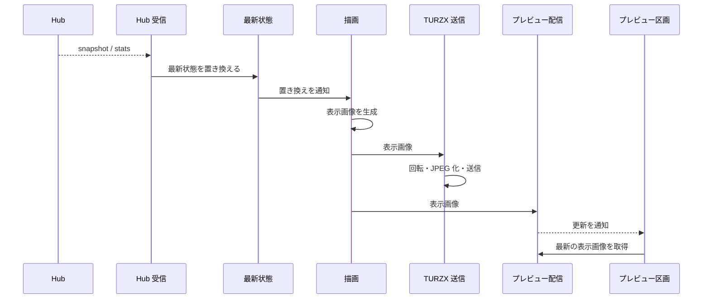

# UCP-1. 受信した最新状態を表示画像にして出力する

適用条件と関与コンテナは [アーキテクチャの一覧](../architecture.md#patterns) を参照します。図は主成功系列を役割名で示し、UC ごとの逸脱は末尾に記録します。

| 役割 | 責務 | 実装パス（段階4完了時に記入） |
| --- | --- | --- |
| Hub 受信 | 保存済みの接続設定で SSE に接続し、snapshot・stats を最新状態へ渡す。止まったら1秒から倍にしながら（上限60秒）再接続する | |
| 最新状態 | 受信した利用状況をメモリにだけ保持し、置き換えを描画へ通知する | |
| 描画 | 最新状態の置き換えと1分ごとの時刻で、利用状況から 1920×462 の表示画像を游ゴシックで描く（Go 標準の `image` と `golang.org/x/image`） | |
| TURZX 送信 | 表示画像を90度回転して JPEG にし、表示先の TURZX へ逐次送る。送信中に届いた画像は最新の1枚だけ残す。再接続時に最新の画像を送る。アプリの終了時に再起動コマンドを送る | |
| プレビュー配信 | 本体の Wails サービス。最新の表示画像を画面へ返し、画像の更新をイベントで通知する | |
| プレビュー区画 | ウィンドウで最新の表示画像を表示する。画像を描かず、状態も持たない | |

- 整合性: 状態更新の主体は最新状態 / 結果確定点はメモリ上の最新状態の置き換え / 障害時は、受信の失敗では最後の最新状態と表示を保ったまま再接続を続け、TURZX の送信失敗では画像を捨てて再接続後に最新の画像を送る。どちらも他方とアプリを止めない / 境界は、描画と送信を最新の1枚だけで追いつくようにすること。
- モックに置き換える境界と合成点: 段階2・3では、`dev:mock` で起動したときに限り、本体が Hub 受信の代わりに、本番の型の固定データを最新状態へ入れる。描画、TURZX 送信、プレビュー配信は本番の処理を使う。段階4で固定データを削除する。

UC 固有の逸脱: なし
