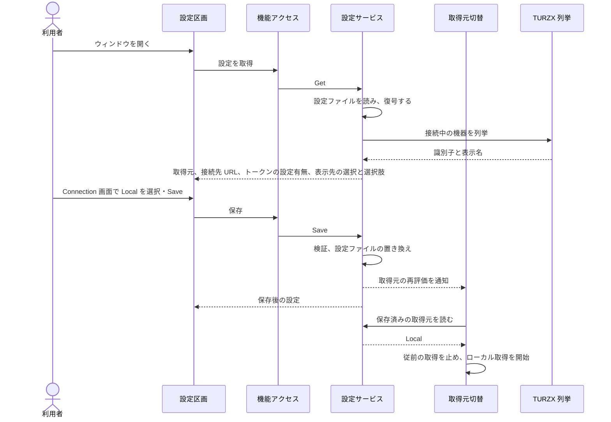

# UCP-2. 入力した設定を検証・保存し、実行中の処理へ反映する

適用条件と関与コンテナは [アーキテクチャの一覧](../architecture.md#patterns) を参照します。パターンからの逸脱は対象 UC ごとに本書へ記録します。図は主成功系列を役割名で示します。

| 役割 | 責務 | 実装パス |
| --- | --- | --- |
| 設定区画 | 保存済みの取得元と表示先・選択肢を表示する。表示先と表示スタイル、および3.5インチ用の向き・巡回間隔・スキップ設定・サービス別の表示内容は `Display` 画面で変更を確定した時点で反映して保存し、失敗したら従前の設定に戻してエラーを表示する。サービス別の表示内容と個別枠の選択は独立に保持する。3.5インチのサービスカードは初期状態で閉じた折りたたみ内でON/OFFと3択を選び、OFF中は最後の3択を残して操作を無効にする。画面全体のスクロールで全サービスと個別枠へ到達できるようにする。取得元と接続先の入力は `Connection` 画面で保存まで保持し、`Save` で保存する。Hub 選択時だけ接続先の入力を表示し、認証トークンは入力だけを受けて表示しない | `frontend/src/usecases/configure-hub/ConfigureHub.tsx`、`frontend/src/usecases/configure-hub/SettingsDraft.tsx`、`frontend/src/usecases/show-usage/ServiceContentSelect.tsx`、`frontend/src/usecases/show-usage/UsagePreview.tsx`、`frontend/src/app/Shell.tsx` |
| 機能アクセス | 本体の設定サービスを呼び出し、取得結果と保存結果を画面の状態へ反映する | `frontend/src/features/settings/queries.ts` |
| 設定サービス | 取得元・表示先・表示スタイルと3.5インチ用の表示設定を検証して設定ファイルを置き換える。表示設定が変わったときは、描画へ知らせて画像を描き直す。別の設定を保存するときも3.5インチ用の表示設定を保持する。Hub 選択時は接続先 URL と認証トークンを1組で DPAPI により暗号化し、画面へは認証トークンの設定有無だけを返す。取得元または接続設定が変わったときだけ、取得元の再評価を通知する（表示設定の変更では、取得を止めない） | `internal/settings/service.go`（サービス別のON/OFFと表示内容は `CompactServices`・`SetCompactService`）、`internal/settings/dpapi_windows.go` |
| 取得元切替 | 保存済みの取得元を読み、従前の取得処理を停止して選択した取得処理を起動する。ローカル取得は同梱の tokscale の結果を表示用の最新状態へ変換する | `main.go`、`internal/localusage/reader.go`、`internal/hub/receiver.go` |
| TURZX 列挙 | 接続中の TURZX を列挙し、機器の識別子と、製品名とシリアル番号から作る表示名を返す | `internal/turzx/devices.go`、`internal/turzx/devices_windows.go` |

- 整合性: 状態更新の主体は設定サービス / 結果確定点は設定ファイルの置き換えの成功 / 障害時は既存の設定ファイルと画面上の入力を保持し、保存しなかったことを示す / 境界は、同時に届いた保存要求を1件ずつ処理すること。

設定に依存する処理への反映: 取得元の変更後に選択した取得処理へ切り替える。表示先の変更後は、変更先の機種に合う画像を生成し、次の画像から新しい表示先へ送る。3.5インチ用の表示設定は [対象シナリオ](../usecases/利用状況をUSBディスプレイに表示する/scenarios/3.5インチでサービスごとの利用枠を順番に表示する.md) に従って巡回へ反映する。

UC 固有の逸脱: なし
