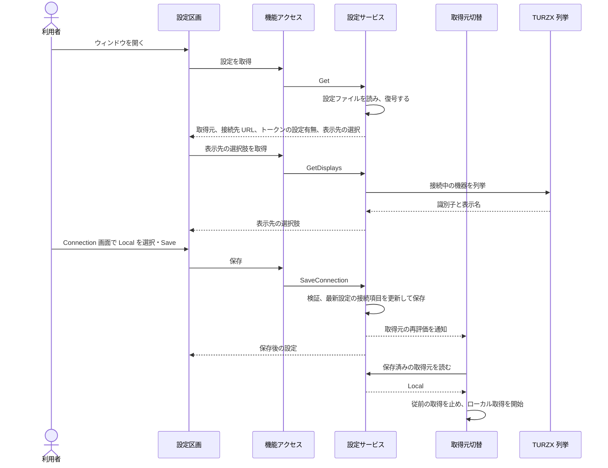

# UCP-2. 入力した設定を検証・保存し、実行中の処理へ反映する

適用条件と関与コンテナは [アーキテクチャの一覧](../architecture.md#patterns) を参照します。パターンからの逸脱は対象 UC ごとに本書へ記録します。図は主成功系列を役割名で示します。

| 役割 | 責務 | 実装パス（段階4完了時に記入） |
| --- | --- | --- |
| 設定区画 | 保存済みの取得元と表示先・選択肢を表示し、表示先と表示スタイルは `Display` 画面で選んだ時点で反映して保存し、失敗したら選択を戻してエラーを表示する。取得元と接続先だけを `Connection` の下書きとして画面間で保持し、`Save` で保存する。表示設定の保存や再取得では下書きを初期化しない。Hub 選択時だけ接続先の入力を表示し、認証トークンは入力だけを受けて表示しない | `frontend/src/usecases/configure-hub/ConfigureHub.tsx`、`frontend/src/usecases/configure-hub/SettingsDraft.tsx`、`frontend/src/usecases/show-usage/UsagePreview.tsx`、`frontend/src/app/Shell.tsx` |
| 機能アクセス | 保存済み設定を React Query で保持し、接続・表示先・表示スタイルそれぞれの保存結果から対象項目だけを反映する。機器一覧は別に取得し、画面がフォーカスを得たときと表示先の選択肢を開いたときに再取得する | `frontend/src/features/settings/queries.ts` |
| 設定サービス | `SaveConnection`・`SetDisplay`・`SetLimitStyle` で対象の値を検証し、ロック内で読み出した最新の設定に対象項目だけを適用して保存する。設定の取得 `Get` と機器一覧の取得 `GetDisplays` を分け、接続保存とスタイル保存では機器を列挙しない。表示スタイルが変わったときは、描画へ知らせて画像を描き直す。Hub 選択時は接続先 URL と認証トークンを1組で DPAPI により暗号化し、画面へは認証トークンの設定有無だけを返す。取得元または接続設定が変わったときだけ、取得元の再評価を通知する（表示先と表示スタイルの変更では、取得を止めない） | `internal/settings/service.go`、`internal/settings/dpapi_windows.go` |
| 取得元切替 | 保存済みの取得元を読み、従前の取得処理を停止して選択した取得処理を起動する。ローカル取得は同梱の tokscale の結果を表示用の最新状態へ変換する | `main.go`、`internal/localusage/reader.go`、`internal/hub/receiver.go` |
| TURZX 列挙 | 接続中の TURZX を列挙し、機器の識別子と、製品名とシリアル番号から作る表示名を返す | `internal/turzx/devices.go`、`internal/turzx/devices_windows.go` |

- 整合性: 状態更新の主体は設定サービス / 結果確定点は設定ファイルの置き換えの成功 / 障害時は既存の設定ファイルと画面上の入力を保持し、保存しなかったことを示す。機器列挙の失敗は一覧取得と特定機器の選択にだけ返し、接続とスタイルの保存を妨げない / 境界は、同時に届いた保存要求を1件ずつ処理し、その時点の最新設定の対象項目だけを変更すること。

設定に依存する処理への反映: 保存後に選択した取得元の処理へ切り替える。TURZX 送信は画像を送るたびに表示先を読み直すため、次の画像から新しい表示先へ送る。

UC 固有の逸脱: なし
