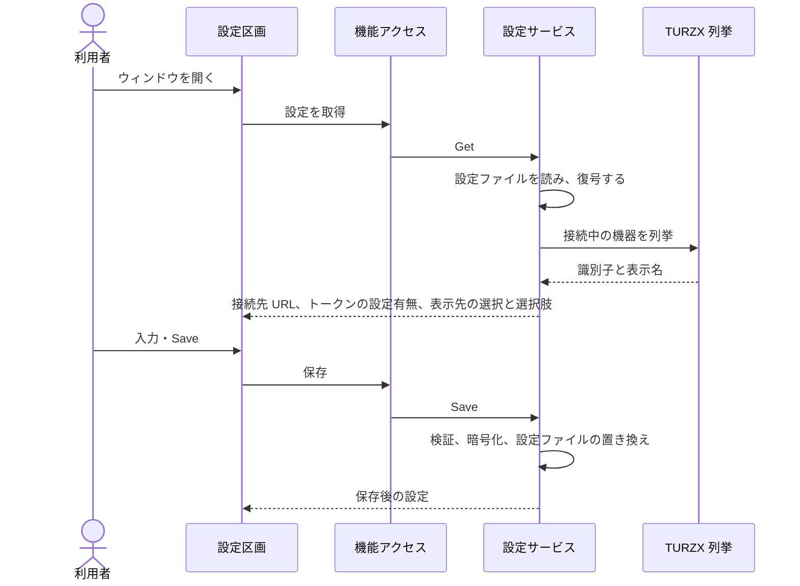

# UCP-2. 入力した設定を検証・保存し、実行中の処理へ反映する

適用条件と関与コンテナは [アーキテクチャの一覧](../architecture.md#patterns) を参照します。パターンからの逸脱は対象 UC ごとに本書へ記録します。図は主成功系列を役割名で示します。

| 役割 | 責務 | 実装パス（段階4完了時に記入） |
| --- | --- | --- |
| 設定区画 | 保存済みの設定と選択肢を表示し、入力を保存まで画面上に保持する。認証トークンは入力だけを受け、表示しない | |
| 機能アクセス | 本体の設定サービスを呼び出し、取得結果と保存結果を画面の状態へ反映する | |
| 設定サービス | 入力を検証し、接続先 URL と認証トークンを1組で DPAPI により暗号化して、表示先の選択とともに設定ファイルを置き換える。画面へは認証トークンの設定有無だけを返す。保存後に、設定に依存する処理へ新しい設定を渡す | |
| TURZX 列挙 | 接続中の TURZX を列挙し、機器の識別子と、製品名とシリアル番号から作る表示名を返す | |

- 整合性: 状態更新の主体は設定サービス / 結果確定点は設定ファイルの置き換えの成功 / 障害時は既存の設定ファイルと画面上の入力を保持し、保存しなかったことを示す / 境界は、同時に届いた保存要求を1件ずつ処理すること。
- モックに置き換える境界と合成点: `frontend/vite.config.ts` の `@settings-service` で、設定サービスのバインディングを `frontend/tests/fixtures/settings.ts` の固定データへ差し替える。`WAILS_FRONTEND_MODE=mock` のときだけ有効で、本番ビルドでは使えない。

UC 固有の逸脱: 「Hubの接続設定を登録・変更する」では、設定に依存する処理（Hub の受信と TURZX への表示）がまだないため、保存後に新しい設定を渡す先はない。
