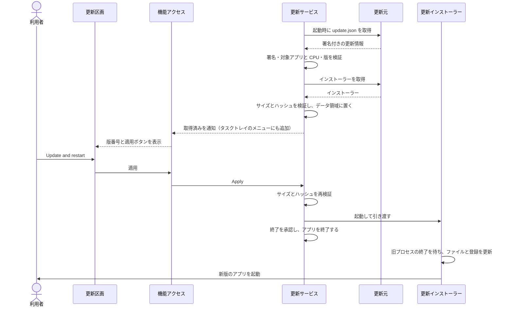

# UCP-3. 検証・引き渡し・外部プロセスによる確定

適用条件と関与コンテナは [アーキテクチャの一覧](../architecture.md#patterns) を参照します。図は本体の外で確定するまでの主成功系列を役割名で示し、UC ごとの逸脱は末尾に記録します。

| 役割 | 責務 | 実装パス（段階4完了時に記入） |
| --- | --- | --- |
| 更新区画 | 更新サービスの状態から版番号と適用ボタン、適用時の失敗を表示する。再検証の失敗では所定の警告を表示する | `frontend/src/usecases/update-app/UpdateApp.tsx` |
| 機能アクセス | 本体の更新サービスから状態を取得し、状態変化の通知を画面の状態へ反映する。適用を呼び出す | `frontend/src/features/updates/queries.ts` |
| 更新サービス | 起動時に1回、更新情報を取得して署名・対象・版を検証し、新版ならインストーラーを取得してサイズとハッシュを検証して置く。状態と公開可能な適用エラーを持ち、同じ状態を `GetStatus` と状態変更の通知で渡す。`main.go` は通知を画面へ送り、取得済み状態に応じてタスクトレイのメニュー項目を出し入れする。適用時に再検証し、インストーラーを起動して終了を承認する。Wails に公開する操作は `GetStatus` と `Apply` に限る | `internal/updates/service.go`、`internal/updates/manifest.go`、`internal/updates/install_windows.go`、`main.go` |
| 更新元 | GitHub Releases の最新リリースから、`update.json` と同じリリースのインストーラーを HTTPS で読み出す。URL と公開鍵は `build/app.json` の `updateSource`・`updatePublicKey` に置く | `internal/updates/source.go` |
| 更新インストーラー | 旧プロセスの終了を待ってから、ファイル、アンインストール情報、サインイン時の自動起動の登録を更新し、新版を起動する | `build/windows/nsis/project.nsi` |
| リリース準備 | インストーラーのサイズとハッシュを入れた更新情報を、リポジトリ外の秘密鍵で署名して `update.json` を作る | `cmd/release/main.go` |

- 整合性: 状態更新の主体は、配置までが更新サービス、確定がインストーラー / 結果確定点はインストーラーによるファイルと登録の更新の完了 / 障害時は、確認・取得・再検証の失敗なら現行版のまま動き続け、配置途中のファイルを削除する。インストーラーは旧プロセスの終了を確認できなければ何も変更せずに中止する / 境界は、更新サービスの操作を1件ずつ処理し、適用後はアプリを終了すること。
- モックに置き換える境界と合成点: 段階2・3では、`dev:mock` のときだけ、更新元を署名付きの v0.2.0 を置いたローカルのフォルダーへ向け、インストーラーの起動を何もしない処理に置き換えた。段階4で削除し、現在は本番の更新元とインストーラーだけを使う。

UC 固有の逸脱: なし
