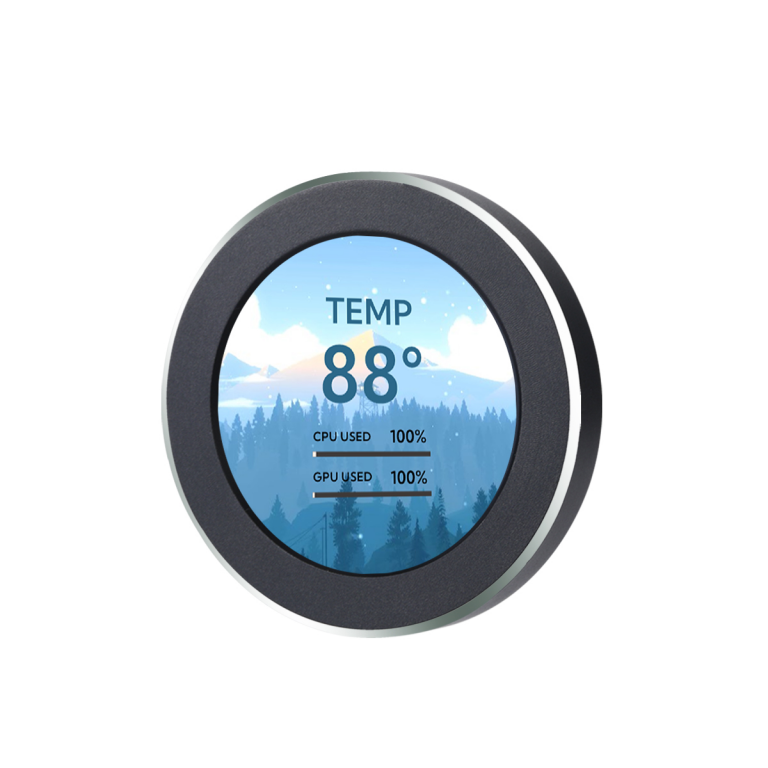
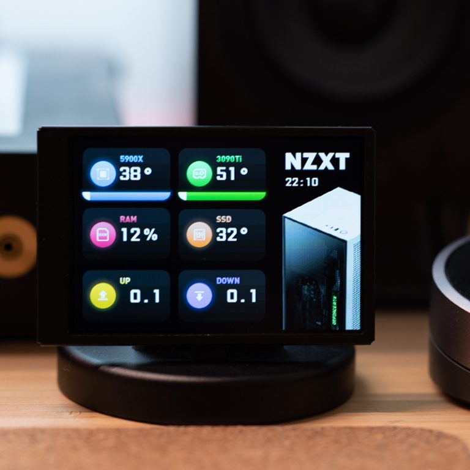

# AI専用ダッシュボードの作り方 〜TURZXでトークン残量を常時表示してみた〜

デスクの上に、Cursor や Claude Code、Codex、Gemini などのトークン消費量や利用枠の残量をリアルタイムに表示する「AI専用ダッシュボード」を作ってみました。


キーボード奥などに置いておくことで、作業領域を圧迫せずに「今月のトークン消費量」や「リセットまでの時間」を一目で確認できます。

## すぐに使ってみたい場合はこちら

アプリとしてそのまま使いたい場合は、本リポジトリの [README](../README.md) を参照してください。

インストーラーを実行してディスプレイを USB に接続するだけで、ローカル集計や [Token Monitor](https://github.com/Javis603/token-monitor) との連携ですぐに使い始められます。

---

## どんなデバイスを使っているのか？

ハードウェアには、PC ステータス表示向けに設計された TURZX（Turing Smart Screen）製の USB スマートディスプレイを使用しています。

### 今回使ったモデル：9.2 インチ ウルトラワイド横長液晶


*画像引用元: [TURZX 9.2 Inch Detail (turzx.com)](https://www.turzx.com/en/2026/09/14/turzx-9-2-inch-detail/)*

解像度 1920×462 px の横長バータイプ液晶を採用しました。キーボード奥やモニター下の隙間に収まり、複数の AI ツール（Claude、Cursor、Codex、Gemini など）のゲージを横一列に並べやすいレイアウトです。付属の USB Type-C ケーブル 1 本で給電とデータ通信の両方が完結します。

- 仕様詳細: [TURZX 公式製品情報](https://www.turzx.com/en/2026/09/14/turzx-9-2-inch-detail/)
- 購入先: [AliExpress（動作確認済み）](https://ja.aliexpress.com/item/1005009533369374.html)、[Amazon（OEM同等品候補）](https://www.amazon.co.jp/dp/B0H1BLTL7C)

> [!NOTE]
> Amazon 等で販売されている外観が同等の製品は、内部ファームウェアや通信仕様の違いにより動作しない可能性があります。確実に動かしたい場合は動作確認済みの製品を推奨します。

### ほかにもこんな形・サイズがある

TURZX には他にも様々なバリエーションがあります。

| モデル | 形状 / 解像度 | 特徴・イメージ |
| --- | --- | --- |
| 2.1 インチ 丸型 | 円形 (480×480 px) | 水冷ヘッドや置き時計のようなラウンド液晶 |
| 3.5 インチ / 5 インチ | 長方形 (480×320 / 800×480 px) | デスクの脇に置けるカードサイズ |
| 8.8 インチ / 12.3 インチ | 横長バー型 (1920×480 / 1920×720 px) | 9.2 インチと同様の細長いウルトラワイドタイプ |


*▲ 2.1 インチ丸型ディスプレイ。時計やタコメーターのようなデザイン*


*▲ 3.5 インチ長方形ディスプレイ。スタンド付きでデスクに置きやすい*

> [!TIP]
> **丸型ディスプレイで計器風にするアイデア**
> 2.1 インチ丸型を並べ、AI ツールごとにスピードメーター風のアナログ計器を描画する構成も可能です。プロトコルは共通のため、画面解像度に合わせて画像を生成すれば同様に表示できます。

---

## なぜ普通のサブモニターではなくこれなのか？

「普通のモバイルモニターを HDMI で繋げばいいのではないか？」という疑問に対し、専用ディスプレイには以下のメリットがあります。

1. **GPU の常時出力負荷がない（Zero GPU Overhead）**:
   OS の追加ディスプレイとして認識されないため、GPU による常時画面出力（60fps 等）の負荷がありません（画面更新時の一時的な画像生成・USB 送信負荷のみ）。
2. **マウスカーソルが吸い込まれない**:
   マウスポインターが画面外に迷い込んだり、ウィンドウをドラッグして見失ったりしません。
3. **他のウィンドウに隠されない**:
   全画面表示中も背面に隠れず、常に視認できます。

---

## どうやって画面を出しているのか？（大まかな仕組み）

通常の映像信号（HDMI 等）ではなく、USB の Bulk 転送を使って画像ファイル（JPEG / PNG）をパケットとして直接流し込む仕組みです。

```
[描画ロジック] 
       │ 画面イメージ (JPEG / PNG バイナリ)
       ▼
[ヘッダー付加・暗号化]  ※DES-CBC で暗号化した 512 バイトヘッダーを先頭に付与
       │ 送信パケット
       ▼
[USB Bulk OUT] ────> [TURZX ディスプレイ] (パケット受信時に画面更新・静止画は維持)
```

一度画像を転送すると次の送信まで表示が保持されるため、値が変化したタイミングのみ送信すれば十分です。

---

## 送信パケットの中身

デバイスに送るデータは、512 バイトの固定ヘッダーと画像データ（JPEG / PNG）で構成されます。

### パケット全体の構成

| オフセット | サイズ | 内容 | 暗号化 |
| --- | --- | --- | --- |
| `0..503` | 504 bytes | コマンド、マジックナンバー、現在時刻、画像サイズ | DES-CBC（鍵: `slv3tuzx`） |
| `504..509` | 6 bytes | 予約領域（ゼロ埋め） | 平文（そのまま） |
| `510..511` | 2 bytes | 終端マーカー（`0xA1, 0x1A`） | 平文（そのまま） |
| `512..` | 可変長 (最大 1 MiB) | 送信したい画像データ本体（JPEG / PNG） | 平文（そのまま） |

### 先頭ヘッダーの平文フォーマット（暗号化前）

暗号化する前の先頭 504 バイトのフォーマットは以下の通りです：

- offset 0: コマンド（JPEG 送信: `101`、PNG 送信: `102`、同期: `10`、再起動: `11`）
- offset 1: 予約（`0x00`）
- offset 2..3: マジックナンバー（固定で `0x1A, 0x6D`）
- offset 4..7: 当日 00:00:00 からの経過ミリ秒（uint32 リトルエンディアン）
- offset 8..11: 画像データのバイト長（uint32 ビッグエンディアン）
- offset 12..503: ゼロ埋めパディング

先頭 504 バイトを共通鍵 `slv3tuzx` で DES-CBC 暗号化し、終端マーカー（`0xA1, 0x1A`）と画像バイナリを連結して送信します。送信後は USB Bulk IN から 6 バイトの応答パケット（`[コマンド, 0xC8, タイムスタンプ]`）が返ります。

---

## ミニマルなコードサンプル (Go)

TURZX 送信用パケットを組み立てる最小限の Go コード例です。

```go
package main

import (
	"crypto/cipher"
	"crypto/des"
	"encoding/binary"
	"fmt"
	"time"
)

// 暗号化キー（ハードウェア共通）
var desKey = []byte("slv3tuzx")

// BuildPacket はコマンドと画像データから TURZX 送信用パケットを組み立てます
func BuildPacket(command byte, imagePayload []byte, now time.Time) ([]byte, uint32, error) {
	// 当日 00:00:00 からの経過ミリ秒を計算
	midnight := time.Date(now.Year(), now.Month(), now.Day(), 0, 0, 0, 0, now.Location())
	timestamp := uint32(now.Sub(midnight).Milliseconds())

	// 504 バイトの平文ヘッダーを用意
	header := make([]byte, 504)
	header[0] = command
	header[2], header[3] = 0x1A, 0x6D
	binary.LittleEndian.PutUint32(header[4:8], timestamp)
	binary.BigEndian.PutUint32(header[8:12], uint32(len(imagePayload)))

	// DES-CBC で暗号化 (鍵・IV ともに "slv3tuzx")
	block, err := des.NewCipher(desKey)
	if err != nil {
		return nil, 0, fmt.Errorf("暗号化の初期化に失敗しました: %w", err)
	}
	encrypter := cipher.NewCBCEncrypter(block, desKey)

	// 512 バイトヘッダー + 画像データのバッファを確保
	packet := make([]byte, 512+len(imagePayload))
	encrypter.CryptBlocks(packet[:504], header)

	// ヘッダー末尾の目印マーカー
	packet[510] = 0xA1
	packet[511] = 0x1A

	// 後ろに画像データをコピー
	copy(packet[512:], imagePayload)

	return packet, timestamp, nil
}
```

生成したパケットを WinUSB や libusb 経由でデバイスの Bulk OUT エンドポイントに書き込むことで、画面が更新されます。

---

## もっと詳しく知りたいときは

排他制御や切断検知、詳細なプロトコル仕様は以下を参照してください。

- [TURZX 操作アーキテクチャ](turzx-architecture.md): プロトコル仕様と詳細設計
- [internal/turzx](../internal/turzx): 実際の Go 実装コード
- [README](../README.md): リポジトリの概要と使い方
