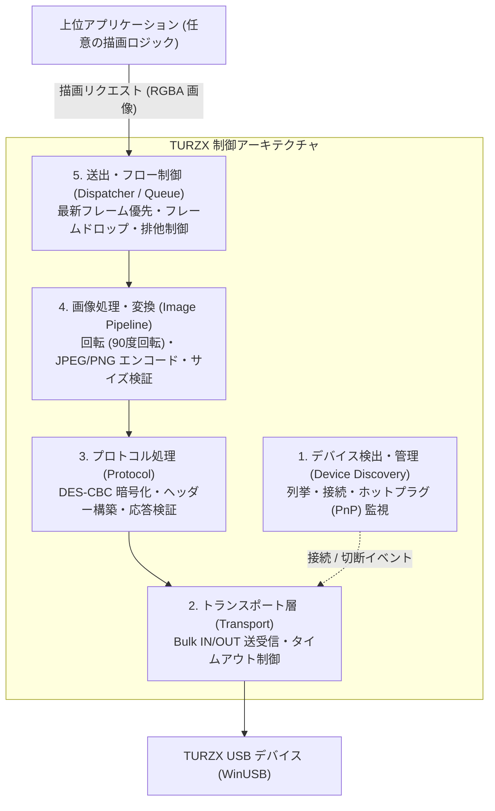

# TURZX 操作アーキテクチャ

本ドキュメントは、TURZX 製の USB 液晶ディスプレイ（代表例: TURZX 9.2インチ等）を汎用的に操作・制御するためのソフトウェアアーキテクチャおよび簡潔な実装例をまとめたものです。特定の表示内容や上位アプリケーション（ダッシュボード、システムモニター等）のロジックから分離し、デバイス制御の中核構造を定義します。

---

## 1. システム概要と特徴

TURZX ディスプレイは、OS から標準のディスプレイアダプター（HDMI / DisplayPort 等）として認識される外部モニターではなく、**USB の Bulk 転送を介してフレーム画像を受信・描画するフレームバッファ型デバイス**です。

### ハードウェア・通信の主要諸元

| 項目 | 内容 |
| --- | --- |
| インターフェース | USB 2.0 Bulk 転送（Bulk IN / Bulk OUT 各1本） |
| デバイス識別 (9.2") | Vendor ID: `0x1CBE`, Product ID: `0x0092` |
| ドライバー | WinUSB（Windows）または libusb（クロスプラットフォーム） |
| 通信プロトコル | 512 バイト固定長ヘッダー（DES-CBC 暗号化） + 画像データペイロード |
| 対応画像形式 | Baseline JPEG、PNG（1 回の送信あたり最大 1 MiB） |
| 描画特性 | 静止画を一度送信すると、再描画コマンドを送るまで表示が維持される |

---

## 2. アーキテクチャ構成

TURZX の制御システムは、責務ごとに 5 つのレイヤーに分離して構成します。



### 各レイヤーの責務

1. **デバイス検出・ライフサイクル管理 (Device Discovery & Lifecycle)**
   - USB デバイスの列挙（VID/PID による特定）。
   - デバイスの抜き差し（Plug & Play / ホットプラグ）検知。
   - デバイスハンドルの生成と切断時のリソース安全解放。

2. **トランスポート層 (Transport)**
   - OS 固有の USB サブシステム（Windows WinUSB、Unix libusb 等）の抽象化。
   - Bulk パイプに対する非同期・同期の Read/Write。
   - タイムアウト制御（推奨: 2〜3 秒）と切断時の I/O キャンセル。

3. **プロトコル層 (Protocol)**
   - コマンドパケットの生成と DES-CBC によるヘッダー暗号化。
   - デバイスからの応答パケットの検証（コマンドエコー・タイムスタンプ整合性）。

4. **画像処理・エンコード層 (Image Pipeline)**
   - 物理液晶の走査方向に応じた画像の回転（9.2 インチでは横長表示のために時計回り 90 度回転が必要）。
   - Baseline JPEG または PNG へのエンコード。
   - ペイロードサイズ上限（1 MiB）の超過チェック。

5. **送出・フロー制御層 (Dispatcher / Queue)**
   - USB 転送レートや描画処理速度に応じたバックプレッシャー対策。
   - **最新フレーム優先（Latest-Frame Policy）**: 送信中に新しい画像が生成された場合、古い保留画像を破棄して常に最新フレームのみを送信する。
   - 逐次送信の排他制御（1 台のデバイスに対して多重送信を行わない）。

---

## 3. プロトコル仕様

### 3.1. パケット構造

送信パケットは、先頭 **512 バイトの制御部**と、それに続く**可変長ペイロード（画像データ）**で構成されます。

| オフセット | 区分 | サイズ | 暗号化 | 格納内容 |
| --- | --- | --- | --- | --- |
| `0..503` | 制御部（暗号化領域） | 504 bytes | あり (DES-CBC) | コマンド、マジックナンバー、時刻、ペイロード長 |
| `504..509` | 制御部（予約領域） | 6 bytes | なし (平文) | ゼロ埋め（`0x00`） |
| `510..511` | 制御部（終端マーカー） | 2 bytes | なし (平文) | 固定値 `0xA1, 0x1A` |
| `512..` | ペイロード | 可変長（最大 1 MiB） | なし (平文) | 送信画像データ（Baseline JPEG または PNG） |

### 3.2. 暗号化ヘッダー仕様（平文 504 バイト）

暗号化領域（504 バイト）の平文フォーマットは以下のとおりです。

| バイト位置 | 型 / 値 | 項目名 | 説明 |
| --- | --- | --- | --- |
| `0` | `uint8` | Command | コマンド番号（10: 同期, 11: 再起動, 101: JPEG, 102: PNG） |
| `1` | `uint8` | Reserved | `0x00` |
| `2..3` | `uint16` | Magic | マジックナンバー（`0x1A, 0x6D`） |
| `4..7` | `uint32` (LE) | Timestamp | 午前 0 時からの経過ミリ秒（リトルエンディアン） |
| `8..11` | `uint32` (BE) | Payload Size | ペイロード長（ビッグエンディアン） |
| `12..503` | `bytes` | Padding | ゼロ埋め（`0x00`） |

- **暗号化アルゴリズム**: DES-CBC（鍵長 8 バイト）
- **共通鍵 / 初期化ベクトル (IV)**: `slv3tuzx`（ASCII 8 文字）
- **パディング**: パケットサイズが 8 バイトの倍数（504 バイト）であるため、追加の暗号パディングは不要。
- **制御部末尾 (`510..511`)**: 暗号化せず、平文で `0xA1, 0x1A` をセット。

### 3.3. コマンド一覧

| コマンド | 番号 | ペイロード | 用途 |
| --- | --- | --- | --- |
| `Sync` | `10` | なし（0 バイト） | 通信確認・ハンドシェイク |
| `Restart` | `11` | なし（0 バイト） | デバイスの再起動 |
| `SendJPEG` | `101` | JPEG バイナリ | 画面更新（Baseline JPEG） |
| `SendPNG` | `102` | PNG バイナリ | 画面更新（PNG） |

### 3.4. 応答（Response）フォーマット

コマンド送信後、Bulk IN パイプから応答（最小 6 バイト）を受信します。

| バイト位置 | 期待値 | 説明 |
| --- | --- | --- |
| `0` | 送信した Command と同値 | コマンドエコー |
| `1` | `0xC8` (200) | 成功ステータスコード |
| `2..5` | 送信した Timestamp と同値 (LE) | タイムスタンプエコー |

先頭 2 バイトが `[Command, 0xC8]` であり、タイムスタンプが送信時と一致することを確認します。

---

## 4. 簡潔な実装例 (Go)

以下は、TURZX の通信プロトコルとパケット構築・応答検証を行うミニマルな Go の実装例です。

```go
package main

import (
	"bytes"
	"crypto/cipher"
	"crypto/des"
	"encoding/binary"
	"fmt"
	"time"
)

const (
	CmdSync    = byte(10)
	CmdRestart = byte(11)
	CmdJPEG    = byte(101)
	CmdPNG     = byte(102)

	MaxPayloadSize = 1024 * 1024 // 1 MiB
)

var desKey = []byte("slv3tuzx")

// BuildPacket はコマンドとペイロードから 512 バイトヘッダー + ペイロードのパケットを生成します。
func BuildPacket(command byte, payload []byte, now time.Time) ([]byte, uint32, error) {
	if len(payload) > MaxPayloadSize {
		return nil, 0, fmt.Errorf("payload exceeds maximum size: %d", len(payload))
	}

	// 当日 00:00:00 からの経過ミリ秒をタイムスタンプとする
	midnight := time.Date(now.Year(), now.Month(), now.Day(), 0, 0, 0, 0, now.Location())
	timestamp := uint32(now.Sub(midnight).Milliseconds())

	// 504 バイトの平文ヘッダーを構築
	header := make([]byte, 504)
	header[0] = command
	header[2], header[3] = 0x1A, 0x6D
	binary.LittleEndian.PutUint32(header[4:8], timestamp)
	binary.BigEndian.PutUint32(header[8:12], uint32(len(payload)))

	// DES-CBC 暗号化 (鍵・IV は共に "slv3tuzx")
	block, err := des.NewCipher(desKey)
	if err != nil {
		return nil, 0, fmt.Errorf("cipher init failed: %w", err)
	}
	encrypter := cipher.NewCBCEncrypter(block, desKey)

	packet := make([]byte, 512+len(payload))
	encrypter.CryptBlocks(packet[:504], header)

	// ヘッダー末尾のマーカー
	packet[510] = 0xA1
	packet[511] = 0x1A

	// ペイロード結合
	if len(payload) > 0 {
		copy(packet[512:], payload)
	}

	return packet, timestamp, nil
}

// VerifyResponse はデバイスからの応答が送信内容と一致しているか検証します。
func VerifyResponse(command byte, expectedTimestamp uint32, response []byte) error {
	if len(response) < 6 {
		return fmt.Errorf("response too short: %d bytes", len(response))
	}
	if response[0] != command {
		return fmt.Errorf("command mismatch: got %d, want %d", response[0], command)
	}
	if response[1] != 0xC8 {
		return fmt.Errorf("error status returned: 0x%02X", response[1])
	}
	resTimestamp := binary.LittleEndian.Uint32(response[2:6])
	if resTimestamp != expectedTimestamp {
		return fmt.Errorf("timestamp mismatch: got %d, want %d", resTimestamp, expectedTimestamp)
	}
	return nil
}

func main() {
	// 例: Sync コマンドのパケット生成
	packet, ts, err := BuildPacket(CmdSync, nil, time.Now())
	if err != nil {
		panic(err)
	}
	fmt.Printf("Sync packet generated: total length=%d, timestamp=%d\n", len(packet), ts)

	// 例: 模擬応答 (コマンド: 10, ステータス: 0xC8, 送信タイムスタンプ)
	mockResp := make([]byte, 6)
	mockResp[0] = CmdSync
	mockResp[1] = 0xC8
	binary.LittleEndian.PutUint32(mockResp[2:6], ts)

	if err := VerifyResponse(CmdSync, ts, mockResp); err != nil {
		fmt.Printf("Verification failed: %v\n", err)
	} else {
		fmt.Println("Verification succeeded!")
	}
}
```

---

## 5. 設計上の留意点

1. **画面の向きと回転コスト**
   - 9.2 インチモデル（1920×462 等）の内部コントローラーは縦向き走査であるため、横長で作成した画像は時計回りに 90 度回転（462×1920）させてから送信する必要があります。
   - 高フレームレートで画面を更新する場合、回転と JPEG エンコードの CPU 負荷がボトルネックになりやすいため、静止画面の更新頻度を抑えるか、差分・必要時のみの描画を行う設計が推奨されます。

2. **通信タイムアウトと切断処理**
   - USB ケーブルの抜去やスリープ復帰時、WinUSB の WritePipe / ReadPipe がハングアップしないよう、必ず 2〜3 秒程度の転送タイムアウト（`PIPE_TRANSFER_TIMEOUT`）を設定します。
   - タイムアウト発生時は直ちに接続ハンドルを破棄（Close）し、再接続フェーズへ移行します。

3. **非同期バッファリングとフレーム破棄**
   - 上位アプリケーションの描画イベント発行速度が USB 転送速度を上回る場合、キューに溜まった古いフレームはすべて破棄し、常に最新の 1 フレームのみを送信することで遅延を防止します。
